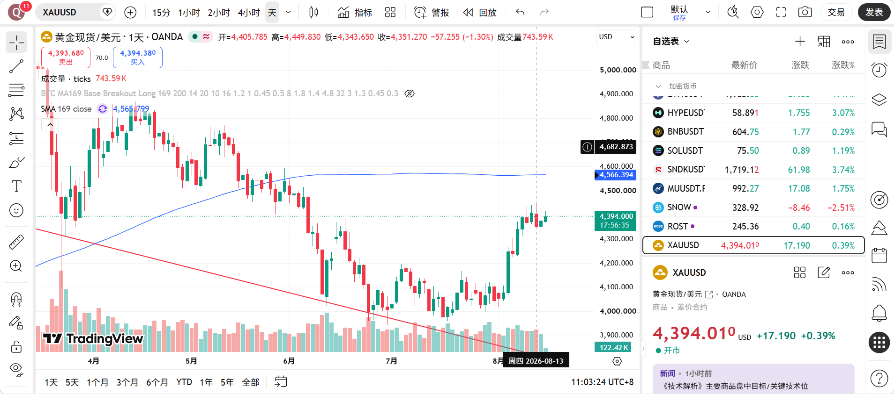

# 观察单与候选计划

更新时间：2026-08-20

本文件存放尚未成交的观察、候选形态与预先计划；它们不是交易记录，不进入盈亏、胜率或 R 倍数统计。只有实际成交后，才在 `my_trade_log.csv` 新增一笔交易；未触发、失效或过期的计划则在本文件结案。

## 当前观察单

### OBS-003｜XAUUSD（黄金现货／美元）｜做空｜169均线跌破后首次反抽｜日线

- **状态**：等待；仅为观察与预先计划，未成交。

- **结构背景**：用户提供的日线图显示价格在 MA169 下方，截图所示 MA169 约为 4,565.799；均线与价格会随新日线变化，截图数值不作为固定下单价格。
- **系统归属**：169均线系统做空。成交前须确认本次是跌破 MA169 后的**第一次**反抽；若不是，则不属于当前已定义的正式触发，只保留观察。
- **入场触发**：只有当价格触及日线 MA169，且该根日线 K 的最高价在 MA169 上方、收盘价在 MA169 下方时，才允许在日线收盘确认后介入空单；盘中触及不入场。
- **计划入场方式或价格**：确认 K 收盘后执行；实际入场价、订单方式与止损距离须在下单前记录。
- **初始止损与失效条件**：`MA169 + 1 × ATR`（使用同一日线周期）。ATR 的参数、价格源和实际止损价待触发时补齐；日线 K 有效收在 MA169 上方则本次“反抽受阻”假设不成立，取消或重新评估本观察单。
- **主动退出条件**：未预设临场主动退出；不因单根 K 线或接近止损主观离场。
- **第一目标与管理方式**：日线前期低点，具体价格待触发时在图上标明后填写；到达前不得因主观预期反向交易。
- **数量与计划风险金额**：待触发后按实际入场至止损距离反推；当前连续亏损纪律下，计划风险不得超过 `75 U`，未填数量与风险前不得下单。
- **有效期／过期条件**：若日线有效收在 MA169 上方，或已不满足“首次反抽”条件，则本单结案或重新建立新观察单。
- **再介入或反向规则**：默认无；本单出场后不自动产生再介入或反向资格。

### OBS-004｜BTCUSDT｜做多｜日线 MA169 收复＋前箱体突破｜日线

- **状态**：已触发且成交；已转入交易日志 ID 41，当前持仓中。
- **截图或结构背景**：用户提供的日线图显示 SMA169 约为 `69,069.94`，当日 K 线盘中最低约为 `68,902.22`；二者均须在日线收盘后重新核对，不作为预先固定价格。前一箱体约为 `57,000–67,000`，箱体高度约 `10,000`。
- **系统归属**：候选的“箱体突破＋MA169 收复”组合。普通箱体突破已弃用，因此本观察单不构成第三个正式系统触发，也不并入正式 169 均线系统统计；本次成交未等待现行正式系统所要求的跟随 K 确认，独立记录为候选样本。
- **入场触发**：日线触发 K 强势突破并收在 MA169 上方。用户在该触发 K 的最高点挂出多单条件单，条件单已触发成交；实际入场价 `70,274`。
- **计划入场方式或价格**：条件单成交于 `70,274`，数量 `0.2 BTC`。
- **初始止损与失效条件**：实际止损为 `68,800`。用户说明因日线级别而扩大止损；该实际止损替代原计划中的“信号 K 最低价下方 1 ATR”，ATR 参数与价格源待补。跌破 `68,800` 视为本笔交易失效。
- **主动退出条件**：未预设临场主动退出；不因单根 K 线、接近止损或主观预期提前离场。
- **第一目标与管理方式**：第一目标为 `76,000`。按 `57,000–67,000` 箱体高度量度，理论测算目标约为 `77,000`；`76,000` 作为较保守的第一执行／观察区，到达后的分批或持有规则须在入场前写明。
- **数量与计划风险金额**：实际数量 `0.2 BTC`；计划风险为 `(70,274－68,800) × 0.2 = 294.80 U`，超过账户 `150 U` 单笔风险上限及当前连续亏损纪律 `75 U`，记为执行偏差。
- **有效期／过期条件**：若日线未收在 MA169 上方，或收复后在正式确认前重新收回 MA169 下方，则本单结案或重新建立新观察单。
- **再介入或反向规则**：默认无；本单出场后不自动产生再介入或反向资格。

OBS-001 与 OBS-002 已结案，见下方历史记录。

## 共同执行边界

- **无观察单不下单。** 所有新实盘交易必须先在本文件建立 `OBS-xxx` 观察单，完成计划后才可等待触发；未建观察单即成交的交易，一律标记为执行偏差，不因最终盈亏改变归类。
- **默认不加仓。** 只有在首次开仓前已写清加仓触发、加仓后总风险上限、止损调整规则与失效条件时，才允许按计划加仓。
- 任何未预先定义的加仓都视为执行偏差；不得为了容纳加仓而扩大原始止损。
- 观察到一个形态不等于可以下单。成交前必须补齐：系统与周期、触发方式、实际入场计划、初始止损、主动退出、目标、数量/总风险和失效／过期条件。

## 新观察单模板

### OBS-xxx｜标的｜方向｜系统｜周期

- **状态**：等待／已触发且成交／已失效／过期
- **截图或结构背景**：
- **系统归属**：仅限 169 均线系统的已定义触发；不属于系统则只观察，不开实盘。
- **入场触发**：只有当 ______ 发生时才允许入场。
- **计划入场方式或价格**：
- **初始止损与失效条件**：
- **主动退出条件**：
- **第一目标与管理方式**：
- **数量与计划风险金额**：
- **有效期／过期条件**：
- **再介入或反向规则**：默认无；未事前写明即禁止。

流程：先建立观察单 → 等待完整触发 → 将实际成交复制到交易日志；未触发、失效或过期则只在本文件结案。出场后该观察单对应的交易假设结束，不自动产生再介入或反向资格。

## 已结案观察单

### OBS-002｜HYPEUSDT｜做空｜169均线跌破后首次反抽｜12小时

- **状态**：已失效，未成交；不新增交易日志。
- **结案原因（2026-08-20）**：12 小时 K 线收在 MA169 上方，已满足本观察单的失效条件，“反抽受阻”做空假设不成立。
- **处理**：本次观察结束，不因失效反向开仓；若未来出现新的、完整且独立的条件，须另建观察单后再评估。

### OBS-001｜ZECUSDT｜4 小时 MA169 守住后的候选再介入多单

- **状态**：已触发且成交，已出场；已转入交易日志 ID 15。
- **背景**：先前 ZECUSDC 均线回踩多单已在首次重新触及均线后退出；本观察单是“均线未被有效跌破后的再介入”，不是原计划中已定义的首次入场。
- **触发与成交**：用户确认 4 小时 K 线收盘条件满足后，做多成交于508.42，数量30 ZEC。
- **原拟定止损**：信号 K 的最低价504.67；初始计划风险为（508.42－504.67）× 30 = 112.5 U，未含手续费与滑点。
- **实际退出**：触碰169均线后离场，出场价507.45，实际亏损37.61 U。
- **指标核对**：原截图显示 `SMA 170 close 502.51`，而规则使用 MA169。该差异未在入场前明确消除，后续同类计划必须统一周期、价格源与名称后再判断信号。
- **系统归类**：候选再介入规则，不并入“4 小时 MA169 高期望主系统”的正式统计；需补齐再介入与退出规则，再做纸上样本验证。

## 状态变更规则

| 状态 | 处理 |
| --- | --- |
| 等待 | 保留在本文件，不记入交易统计 |
| 已触发且成交 | 将完整计划复制到交易日志，记录实际入场、止损、数量和计划风险 |
| 已失效／过期 | 在此处补一行结论，不新增交易日志记录 |

本文件只用于学习、研究和复盘，不构成投资建议。
