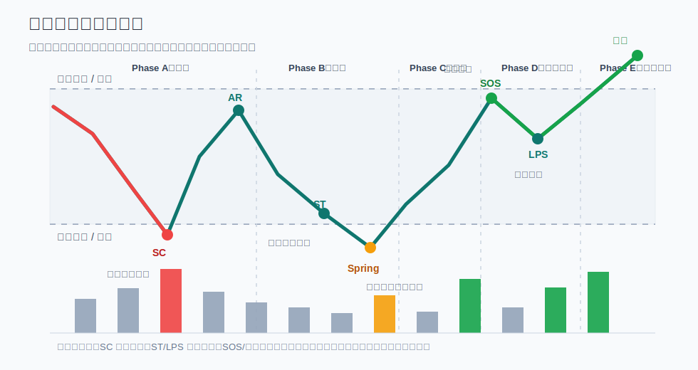

# 0004 威科夫入门：从箱体到可验证假设

## 学习目标

这一课先不追求把威科夫所有术语背下来。目标只有一个：

```text
把“这个形态像吸筹”翻译成一组可以记录、可以等待触发、可以失败退出的假设。
```

这直接服务于你的 `MISSION.md`：你已经在做箱体突破、杯柄突破和均线回踩，接下来要把这些主观 setup 变得更稳定、更可解释、更可复盘。

## 为什么现在学威科夫

你现在最需要的不是再增加一个“看图理由”，而是给已有系统加一层结构判断。

威科夫适合你当前阶段的原因是：

- 它天然关注箱体、突破、回踩和量价关系
- 它能帮助你区分“真正准备突破”和“看起来像机会”
- 它可以和你的系统内交易规则相容：先结构判断，再等待触发，再定义失效

但它也有一个危险：如果只学术语，很容易把任何震荡都解释成吸筹，把任何假突破都解释成洗盘。这样会削弱你的进场纪律。

所以本课的底线是：

```text
威科夫只能提供背景假设，不能替代你的入场触发。
```

## 必要概念

### 1. 威科夫看的是供需变化

威科夫方法的核心不是神秘图形，而是观察价格、成交量、时间和区间位置，判断供给和需求谁在占上风。

你可以先用四个问题代替复杂术语：

```text
1. 下跌时，卖压是在增强还是减弱？
2. 上涨时，需求是在增强还是衰竭？
3. 区间里，价格更容易被拉回上沿还是砸回下沿？
4. 突破后，市场是接受新区间，还是快速跌/涨回旧区间？
```

这四个问题比背术语更重要。

### 2. 三个核心法则

**供给与需求**

需求大于供给，价格更容易上涨；供给大于需求，价格更容易下跌。实盘复盘时，不要只写“放量”，要写“放量后有没有推进”。

**因与果**

横盘区间可以理解为后续趋势的准备阶段。区间越长、换手越充分，突破后可能越值得关注。但这不是收益承诺，方向也必须由后续价格行为确认。

**努力与结果**

成交量是努力，价格推进是结果。如果成交量很大但价格推不动，说明努力和结果不匹配，可能意味着上方供给或下方承接正在改变结构。

下面这张图只是吸筹区间的教学示意，不是固定模板。真实走势经常缺少某些事件，或者顺序不那么标准。



### 3. 吸筹区间的五个阶段

你说的“五个阶段”通常指吸筹或派发交易区间里的 Phase A 到 Phase E。先用吸筹来理解：

| 阶段 | 一句话 | 你要观察什么 |
| --- | --- | --- |
| Phase A | 原来的下跌被停止 | 是否出现 PS、SC、AR、ST，供应是否开始被承接 |
| Phase B | 在区间里建立“因” | 是否反复震荡、吸收供应，后半段下跌量能是否减少 |
| Phase C | 测试剩余供应 | 是否出现 Spring / Shakeout，跌破后能否快速收回 |
| Phase D | 需求开始占优 | 是否出现 SOS，回踩是否变浅、缩量，LPS 是否守住 |
| Phase E | 离开交易区间 | 是否真正突破并被市场接受，而不是马上跌回区间 |

为什么我第一版没有先讲它？因为 Phase A-E 很容易被学成“标准剧本”：看到横盘就硬套 A、B、C、D、E。对你现在更重要的是先建立三件事：

```text
结构只是背景；
触发必须独立完成；
失效位置必须提前写清楚。
```

现在把五阶段加进来，正确用法是：它帮助你判断“当前更像哪一段”，但不能直接替代买点。

### 4. 吸筹不是“低位横盘”的同义词

低位横盘只说明价格暂时不跌了，不自动等于吸筹。

更像吸筹的结构，至少要看到这些线索中的一部分：

- 下跌后出现明显承接，继续下跌变困难
- 回到低位测试时，成交量和波动收窄
- 假跌破后能快速收回区间
- 后续上涨的价差和成交量更健康
- 突破后回踩不轻易跌回旧箱体

如果这些都没有，只说“主力吸筹”就是故事，不是分析。

### 5. 派发不是“高位横盘”的同义词

高位横盘也不自动等于派发。更像派发的结构，通常要看到：

- 上涨后放量但继续上推困难
- 突破上沿后很快跌回区间
- 下跌时更顺畅，上涨时更吃力
- 跌破区间后反抽无力
- 好消息、强情绪或一致看多时，价格反而不再有效推进

你是主要做多的趋势交易者，所以学派发的意义不是马上做空，而是帮助你减少错误追多。

## 和你的三个 setup 怎么连接

### 箱体突破

以前你可能会问：

```text
突破了吗？
```

威科夫视角会多问三句：

```text
突破前供应有没有减少？
突破时需求有没有增强？
突破后是否被市场接受？
```

如果突破后立刻跌回箱体，这不是“差一点成功”，而是你的系统必须定义的失败情形。

### 杯柄突破

杯柄可以暂时看作一种再吸筹结构。

对你来说，关键不是“像不像杯柄”，而是：

```text
柄部是否缩量收窄？
突破前是否有供应减少？
突破时是否有需求恢复？
失败点是否清楚？
```

如果柄部越来越宽、回撤越来越深、突破前已经连续急拉，那它可能只是你想买而找出的形态理由。

### 均线回踩

均线回踩不要只看“碰到均线”。更重要的是：

```text
回踩时是不是缩量？
下跌速度有没有放慢？
转强时有没有重新放量或重新站回关键小结构？
如果跌破哪里，说明这不是健康回踩？
```

这能防止你把所有下跌都说成“回踩机会”。

## 一个最小练习

找一张你最近关注的箱体、杯柄或均线回踩图，只回答下面 8 个问题。

```text
标的：
市场：crypto / us_stock / a_share
主 setup：箱体突破 / 杯柄突破 / 均线回踩

1. 当前结构更像：吸筹 / 再吸筹 / 派发 / 再派发 / 不确定
2. 我这样判断的 2 个证据是：
3. 反驳这个判断的 1 个证据是：
4. 这只是观察池理由，还是已经完成入场触发？
5. 如果还没触发，具体要等什么？
6. 如果提前试仓，最多承担多少 R？
7. 结构失效点在哪里？
8. 如果失败，我要记录为 setup 问题、执行问题，还是市场环境问题？
```

重点是第 3 题。能写出反证，说明你没有被图形催眠。

## 自测

回答下面 4 个问题：

1. 为什么“低位横盘”不等于“吸筹”？
2. 为什么“放量突破”还要看突破后是否被市场接受？
3. 如果你觉得某个币在吸筹，但你的系统触发还没完成，你最多能做什么？
4. 对你当前阶段来说，威科夫最应该帮助你增加交易，还是减少系统外交易？

我的标准答案很简单：

```text
威科夫先用来提高过滤质量，而不是用来增加下单理由。
```

## 下一步建议

下一节可以继续学“吸筹区间的事件：SC、AR、ST、Spring、SOS、LPS”，但我建议你先拿一张真实图做本课的 8 问练习。

你可以把图发给我，或者只写出 8 个答案。我们下一步不急着判定对错，先训练一件事：把主观判断写成可检查的假设。

## 风险提醒

这里的内容只用于学习、研究和模拟验证，不构成个性化投资建议。威科夫方法属于技术分析框架，需要大量图表训练和复盘验证；它不能保证收益，也不能替代止损、仓位管理、手续费/滑点评估和系统内交易纪律。

## 参考

- [StockCharts ChartSchool: The Wyckoff Method: A Tutorial](https://chartschool.stockcharts.com/table-of-contents/market-analysis/wyckoff-analysis-articles/the-wyckoff-method-a-tutorial)
- [CMT Association: Wyckoff Laws and Tests](https://cmtassociation.org/technically_speaking/technically-speaking-september-2015/)
- [Investor.gov: What is Risk?](https://www.investor.gov/introduction-investing/investing-basics/what-risk)
